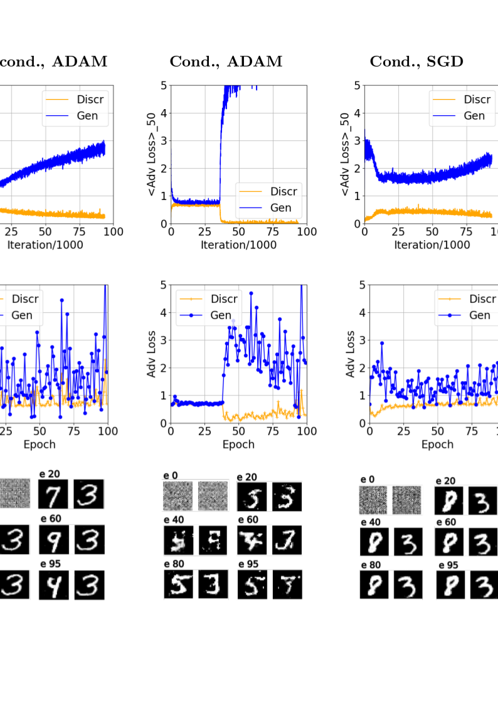

Deep convolution generative adversarial network (DCGAN)
============================================

This repository contains modification of the PyTorch DCGAN tutorial implementation:
```
https://pytorch.org/tutorials/beginner/dcgan_faces_tutorial.html
```
which is based on the paper

```
Radford, Alec, Luke Metz, and Soumith Chintala. "Unsupervised representation learning with deep convolutional 
generative adversarial networks." arXiv preprint arXiv:1511.06434 (2015)
```

Besides that it realizes also conditoinal GAN which  generates images satisfying the 
required condition. In the present case condition is a number 0-9. 

Instead of the 64x64 RGB images of face data set as in the original tutorial here the 
28x28 grayscale images from MNIST dataset are used 
for training. 

### Requirements

The model is implemented in Python 3.11.0 and uses several additional libraries which can be found in
`environments.yaml`.

### Setup

To install this package, simply clone the git repo:

```
git clone ...
cd ...
conda env create -f environment.yaml
conda activate gan-tutorial
```

### Contents

The repository is structured as follows.

* `./results_sgd`: results of training and inference for optimizer SGD
* `./logs_adam_05`: results of training and inference for optimizer ADAM with b1=0.5
*  `./logs_adam_09`: results of training and inference for optimizer ADAM with b1=0.5
* `./models`: Discriminatros, Generator and Classifier modelsdefinition
* `./data`:  Possibele csv files with grayscale image datasets

### Dataset

The data set is downloaded from torchvision MNIST dataset, but can also be read from csv files
put in the folder `./data`.

### Usage

To train the usual and conditional GAN launch the corresponding commands

```
make run_training_unconditional_gan
make run_training_conditional_gan
make run_classification
make run_plt_loss
```

In case of the conditional GAN the KNN classifier is trained on the generated fake dataset and 
then accuracy is calculated on the real dataset. 

### Examples of training curves and generated images

Here are some examples of generated MNIST digits:



